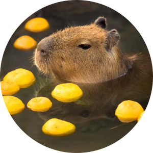

<!--markdownlint-disable MD033 MD041-->
<center>
<!--img src="https://images.weserv.nl/?url=avatars.githubusercontent.com/u/98146267?v=4&h=300&w=300&fit=cover&mask=circle&maxage=7d" alt="Avatar" width="150" height="150" style="border-radius:50%;" align="left"-->


<p>
<p align="center" width="54%">
  <br />
  
  <br/><br/>
  
  <p align="center">
    <a href="https://mizumoto-cn.github.io" align="center">🌱 Home | 豚窝 🌱</a>
  </p>
</p>
</p>
  <!--img width="33.2%" height="33.2%" src="http://github-profile-summary-cards.vercel.app/api/cards/productive-time?username=mizumoto-cn&theme=github&utcOffset=9"  align="right" /-->

<p align="center">

<!-- [TRPcG ✈](https://github.com/mizumoto-cn/TRPcG) a fast, stable, light-weight and high-performance RPC framework for Go.

[Go Balancer 🚦](https://github.com/mizumoto-cn/GoBalancer) A fast, stable, lightweight layer-7 load balancer written in go. Based on `net/http/httputil`, also a load-balancing algorithm library. -->

</p><p align="center">

</p>
<p align="left">
<!-- 
 -->


</p>

<!--  -->

</center>

<br />

<details><summary align="left" style="color:#0612ff;font-weight:bold;font-size:17px" >📫 About Me <sub style="color:#ff2344">(Click here!)</sub></summary>
<pre>
    <code language="golang">
        Mizumoto := struct {
            Name string
            Age int
            Location string
            Nationality string
            blog string
            email string
        }{
            Name:           "Mizumoto",
            Age:            25,
            Location:       "Tokyo/Kanagawa, Japan",
            Nationality:    China 🇨🇳
            blog:           "blog.mizumoto.tech"
            email:          "mizumoto@mizumoto.tech"
        }
    </code>
</pre>
</details>

<br />

<h3 align="left" style="color:#2412ff;font-weight:bold;"> 🏆 My Github Trophies </h3>
<div align="center">
  
</div>

<br />

<h3 align="left" style="color:#2412ff;font-weight:bold;">📊 Weekly development breakdown</h3>
<!--START_SECTION:waka-->

```txt
Total Time: 6 hrs 35 mins

Other        4 hrs 51 mins         ██████████████████▒░░░░░░   73.73 %
Markdown     54 mins               ███▒░░░░░░░░░░░░░░░░░░░░░   13.74 %
YAML         21 mins               █▒░░░░░░░░░░░░░░░░░░░░░░░   05.34 %
Text         12 mins               ▓░░░░░░░░░░░░░░░░░░░░░░░░   03.13 %
SQL          8 mins                ▓░░░░░░░░░░░░░░░░░░░░░░░░   02.10 %
```

<!--END_SECTION:waka-->

<!--
**mizumoto-cn/mizumoto-cn** is a ✨ _special_ ✨ repository because its `README.md` (this file) appears on your GitHub profile.

Here are some ideas to get you started:

- 🔭 I’m currently working on ...
- 🌱 I’m currently learning ...
- 👯 I’m looking to collaborate on ...
- 🤔 I’m looking for help with ...
- 💬 Ask me about ...
- 📫 How to reach me: ...
- 😄 Pronouns: ...
- ⚡ Fun fact: ...
-->
